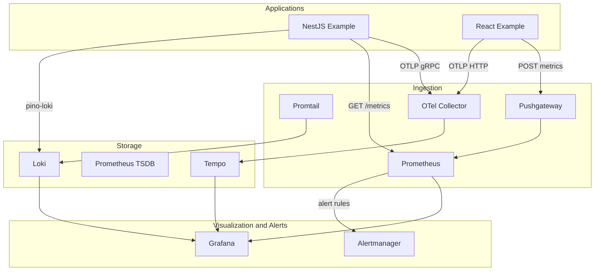

# Architecture

## Overview

The observe stack provides **logs**, **metrics**, and **distributed traces** for local development and small deployments (roughly 1–10 services, 10–100 RPS per service).



## Components

| Component | Image (compose) | Role |
|-----------|-----------------|------|
| **Loki** | `grafana/loki:3.4.2` | Log aggregation and storage |
| **Promtail** | `grafana/promtail:3.4.2` | Docker + file logs → Loki |
| **Prometheus** | `prom/prometheus:v3.2.1` | Scrape, rules, TSDB |
| **Alertmanager** | `prom/alertmanager:v0.28.1` | Alert routing (Slack/webhook) |
| **Grafana** | `grafana/grafana:11.5.2` | Dashboards, Explore, trace-to-logs |
| **Tempo** | `grafana/tempo:2.7.1` | Trace storage and query API |
| **OTel Collector** | `otel/opentelemetry-collector-contrib` | OTLP ingress → Tempo |
| **Pushgateway** | `prom/pushgateway` | Short-lived / browser metrics |
| **node-exporter** | `prom/node-exporter` | Host metrics (no public host port) |
| **nestjs-example** | built locally | Demo app (profile `examples`) |

## Data flows

### Logs

```
NestJS (Pino + pino-loki) ──HTTP push──► Loki
Docker containers ──Promtail──► Loki
```

Common labels: `job=nestjs-app`, `service`, `environment`, `level`.

### Metrics

```
NestJS :3001/metrics ──scrape──► Prometheus
node-exporter:9100 ──scrape──► Prometheus  (internal network only)
pushgateway:9091 ──scrape──► Prometheus     (honor_labels: true)
otel-collector:8889 ──scrape──► Prometheus
```

Browser metrics **cannot** be scraped directly. The React example pushes to Pushgateway under job `web-app`.

### Traces

```
NestJS (OTel Node SDK) ──OTLP/gRPC :4317──► OTel Collector ──► Tempo
React (OTel Web SDK)   ──OTLP/HTTP :4318──► OTel Collector ──► Tempo
```

Grafana Tempo datasource links traces to Loki logs (`tracesToLogs` on `service.name` / `job`).

### Alerts

```
Prometheus (alerting-rules.yml) ──► Alertmanager ──► receivers (Slack, webhook, or no-op)
```

Default Alertmanager config uses a **no-op receiver** for local dev so the process starts without a real Slack webhook.

## Design decisions

### 1. Pushgateway for browser metrics

Prometheus pull model does not work from browsers. RUM and Web Vitals are pushed to Pushgateway; Prometheus scrapes with `honor_labels: true`.

### 2. OTel Collector as single ingress

- Backend: gRPC `localhost:4317` (or `otel-collector:4317` in Docker)
- Frontend: HTTP `localhost:4318` with CORS for Vite (`:5173`)

Avoids exposing Tempo OTLP directly to the browser and centralizes routing.

### 3. Compose profile `examples`

`nestjs-example` is optional so the core stack stays lightweight. Prometheus always defines the scrape job; the target is DOWN until the profile is enabled — this is intentional.

### 4. node-exporter without host port

Port `9100` is often taken on developer machines. Scraping uses Docker DNS `node-exporter:9100` on network `observe`.

### 5. Alertmanager on 127.0.0.1:9093

Published as `127.0.0.1:9093:9093` to reduce localhost/IPv6 binding issues on macOS. Healthcheck waits for gossip settle (`start_period: 15s`).

### 6. No TLS or auth (v1)

Suitable for local development. Before production:

- Enable Grafana/Loki authentication
- TLS termination
- Replace no-op Alertmanager receiver with real Slack/PagerDuty/webhook URLs

## Network and ports

All services use Docker network **`observe`**.

| Service | Host port | Internal access |
|---------|-----------|-----------------|
| Grafana | 3000 | `grafana:3000` |
| NestJS example | 3001 | `nestjs-example:3001` (profile) |
| Loki | 3100 | `loki:3100` |
| Tempo | 3200 | `tempo:3200` |
| OTel gRPC | 4317 | `otel-collector:4317` |
| OTel HTTP | 4318 | `otel-collector:4318` |
| Prometheus | 9090 | `prometheus:9090` |
| Alertmanager | **127.0.0.1:9093** | `alertmanager:9093` |
| Pushgateway | 9091 | `pushgateway:9091` |
| node-exporter | — | `node-exporter:9100` |
| React (Vite) | 5173 | host process |

## Configuration files

| Path | Purpose |
|------|---------|
| `docker-compose.yml` | Service definitions, volumes, profiles |
| `loki/loki-config.yml` | Retention, storage |
| `promtail/promtail-config.yml` | Log scrape targets |
| `prometheus/prometheus.yml` | Scrape jobs, Alertmanager target |
| `prometheus/alerting-rules.yml` | Alert definitions |
| `alertmanager/config.yml` | Routes and receivers |
| `tempo/tempo.yaml` | Trace storage |
| `otel-collector/config.yaml` | OTLP pipelines |
| `grafana/provisioning/` | Datasources and dashboard loader |

## Scaling beyond local

For higher volume or HA:

- Grafana Cloud / Mimir / Loki Cloud
- Datadog via `remote_write` in `prometheus/prometheus.yml` (commented template)
- Kubernetes: Grafana k8s monitoring or kube-prometheus-stack

See [SETUP.md](SETUP.md) for operations and [DASHBOARDS.md](DASHBOARDS.md) for Grafana customization.
